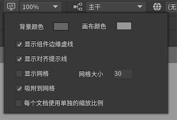

## 打开项目

启动FairyGUI编辑器后，首先显示的是欢迎窗口：

- `创建新项目` 点击后显示创建项目的对话框。
- `打开项目` 通过选择一个项目描述文件 xxx.fairy 打开一个已有项目。
- `打开文件夹` 通过选择项目所在的目录打开一个已有项目。如果你的项目是2.x版本创建的项目，那么只能用这个菜单打开。
- `最近打开项目` 曾经打开过的项目可以直接从列表中点击打开。点击左边的X可以删掉历史记录，但不会删掉项目内容。

编辑器支持同时打开多个项目。Windows平台下，可以通过重复双击桌面上的图标启动多个FairyGUI编辑器。Mac平台下，你可以在打开一个项目后，再点击主菜单“文件”->“新建窗口”，然后再打开其他项目。

## 创建新项目

在指定位置创建一个新的UI项目。

- `项目名称` 项目名称。可以使用中文，创建后也可以随便修改。
- `项目位置` 项目位置。**注意：请不要使用带中文的路径。**
- `项目类型` UI项目类型，即UI实际运行的平台。不同的平台在显示效果、发布结果上有一定的差别。不过不需要担心这里选择错了项目类型，在项目创建后可以随时调整UI项目类型，操作位置在菜单“文件->项目设置”里。

FairyGUI的项目在文件系统的结构为：

- `assets` 包内容放置目录。
  - `package1` 每个包一个目录。目录名就是包名。
- `assets_xx` 分支内容放置目录，xx是分支名称。多个分支则存在多个类似名称的目录。
- `settings` 配置文件放置目录。
- `.objs` 内部数据目录。**注意：不要加入版本管理，因为这里的内容是不需要共享的。**
- `test.fairy` 项目标识文件。文件名就是项目名称，可以随便修改。

## 主界面

编辑器主界面由以下几个部分组成：

1. 主菜单。在Mac系统里，主菜单和Mac应用程序菜单集成；在Windows系统里，主菜单显示在主界面最上方。
2. 主工具栏。常用的功能按钮。
3. 文档视图，包括已打开的文档的列表，侧工具栏和舞台区域。
4. 状态栏，显示控制台输出的最后一条信息。点击可以打开控制台。
5. 各个功能视图，用户可以按使用习惯将它们拖动到不同位置，也可以关闭。右键点击面板的标题栏，在右键菜单中选择“关闭”即可。如果要重新打开，在“主菜单->视图”里操作。

## 主工具栏

-  新建包。

-  新建组件。

-  新建标签。

-  新建按钮。

-  新建下拉框。

-  新建进度条。

-  新建拖动条。

-  新建字体。

-  新建动画。

-  导入素材。从文件管理器/访达中导入。

-  保存当前文档。

-  保存所有文档。

-  发布。默认功能是发布当前的活跃包（如果编辑器焦点在资源库，则活跃包是指资源库当前选中的资源所在的包；如果编辑器焦点在文档视图，则活跃包是指当前正在编辑的组件所在的包）。这个功能可以通过[偏好设置](preference.html)的选项改变为发布所有的包或者发布所有修改过但未发布的包。

-  仅发布定义。如果用户没有修改图片、动画、字体等素材，而仅仅修改了界面布局之类，可以只发布定义，也就是不重新生成纹理集。这样可以提升发布速度。但如果包的内容不是非常多，这个提升并不显著。

-  打开发布设置对话框。

-  进入测试模式，显示测试界面。

-  重新启动测试。仅在测试模式下有效。

-  设定舞台缩放比例，背景色，辅助线等。调整舞台比例除了通过这里的下拉框选择外，还可以通过以下几种方式：
  - 按住Ctrl/Cmd键同时滚动鼠标滚轮；
  - 使用快捷键Ctrl/Cmd+加号或减号；
  - 使用快捷键Ctrl+1可以恢复100%比例。
  
  点击左边屏幕图标弹出以下对话框：

  

  - `背景颜色` 舞台的背景颜色。
  - `画布颜色` 组件的背景颜色。如果组件需要与众不同的背景颜色，可以在组件属性里设置。
  - `显示组件边缘虚线` 在文档里用虚线显示组件的包围。
  - `显示对齐提示线` 当移动或改变元件尺寸时，如果元件的上下左右边缘和其他元件对齐时，会有绿色的提示线提示。
  - `显示网格` 显示网格线。
    - `网格大小`  设置网格线距离。
  - `吸附到网格` 勾选后，移动元件结束时将自动对齐到网格线。
  - `每个文档使用单独的缩放比例` 如果不勾选，则所有文档共用缩放比例设置；如果勾选，则每个文档使用单独的缩放比例设置，例如编辑文档A时，将文档缩放设置为80%，切换到编辑文档B，则缩放比例自动恢复为100%，再切换回文档A，缩放比例自动恢复为80%。

-  切换当前项目的分支。点击左边图标可以打开分支设置对话框。

-  切换当前项目的语言。点击左边图标可以打开语言设置对话框。

## 资源库

资源库视图里采用树状结构显示。顶层节点是包，每个包下面可以创建文件夹。

### 一般操作

- `导入` 将图片、声音、动画、文字等素材从文件管理器/访达中拖动到资源库，完成资源的导入。也可以直接将素材放置到包目录里，然后点击刷新按钮。支持将另外项目的包直接拷入到assets目录。

- `移动` 资源可以在各个文件夹或者各个包之间随意拖动，不会破坏资源之间的引用关系。文件夹也可以拖动。

- `快速定位` **当焦点在库视图时，在键盘上连续按下字母，可以快速定位到当前目录下指定名称的资源**。例如，连续按下abc，则定位到名称以“abc”开头的第一个资源；如果是中文字符，则只需按下拼音的第一个字母。例如，连续按下csb，则定位到名称以“测试包”开头的第一个资源。

- `重命名` 按下F2可修改资源名称。

### 工具栏

-  检查**所有包**的package.xml，看是否被外部修改，如果有，则重新载入包；同时在文件系统里检查所有**已打开的包**，如果有资源放置在包目录下，但不在包中的，则导入到包。

-  在库中定位当前活动文档对应的组件。

-  与编辑器连接。激活这个功能后，当活动文档发生切换时，会同时在库中选中活动文档对应的组件。 

-  切换两栏视图。库视图支持两种结构，单栏和两栏。单栏就是传统的树结构；两栏则由左边的树和右边的列表组成。

  

-  全部收缩。

-  改变右栏列表显示图标的大小。

### 右键菜单

- `属性` 修改资源的属性，对图片、动画这些资源，支持多选。例如，选定了多个图片后，点击属性，弹出如下对话框：
  
  

  这个功能对文件夹同样有效。选中文件夹后，点击属性，弹出如下对话框：

  

- `复制` 复制选中的资源。提示：复制、粘贴功能支持跨项目，同时打开两个项目后，就可以互相复制粘贴。

- `移动至` 点击后弹出一个对话框用于选择移动的目标位置。

- `粘贴` 粘贴已复制的内容以及他们**引用的未导出的资源**到当前位置。如果粘贴时有同名的情况，会有这样一个提示：
  
  

  - `重命名` 重命名同名的资源。
  - `替换` 覆盖同名的资源。
  - `跳过` 不进行粘贴操作，如果粘贴的内容中含有对该资源的引用，则同时修改引用。举例：现准备粘贴组件A和图片B，A组件里放置了图片B。粘贴的目标位置已经含有同名资源dest/B，如果选择跳过，则最后粘贴的只有组件A，而且在新的A组件里，B图片对应的是dest/B。

- `粘贴全部` 粘贴已复制的内容以及他们**引用的所有资源**到当前位置。

- `更新资源` 使用新的资源替换当前选定的资源。也可以在文件管理器/访达中直接替换文件，后者适合批量操作。

- `设置为导出` 设置资源为导出。包内的每个资源都有一个是否导出的属性，**已导出的资源的图标右下角有一个小红点**。一个包只能使用其他包设置为已导出的资源，而设置为不导出的资源是不可访问的。同时，只有设置为导出的组件才可以使用代码动态创建。

- `在文件管理器（访达）中打开` 在文件管理器（或访达）中定位选中的资源。**注意，如果资源路径中含有空格，则可能定位失败。**

- `创建分支` 详见[分支功能](branch.html)里的介绍。

### 包分组

当库面板里的包比较多时，查找东西比较麻烦。编辑器提供了将包分组的功能。

点击编辑分组，显示对话框：

左边列表可以对分组进行增删改和调整显示顺序；右侧列表选择在该分组中的包。
特别的，**我的工作区（本地）**是一个特别的分组，这个分组不可删除不可改名，它的设置保存在用户本机中，不会保存到项目的settings里，因此不会与团队共享。它专用于记录个人工作任务。

## 收藏夹

收藏夹提供了一个快速访问常用组件的功能。可以将一些常用的组件或资源放置在收藏夹里，便于快速访问。

在资源库里右键单击一个或多个资源，然后在右键菜单中选择“加入收藏夹”，就可以将资源加入收藏夹。

## 显示列表

这里显示的是组件的显示列表。按显示顺序排列，列表中越往下的元件显示在越前面。可以在列表中直接拖拽改变元件改变它们在显示列表中的位置。

-  展开或者收起所有组
-  重命名当前选定的元件
-  屏蔽显示控制器。屏蔽后所有被显示控制器隐藏的内容都会显示出来。参考[这里](controller.html#显示控制)。
-  屏蔽关联系统。屏蔽后，当手动修改元件坐标和尺寸时，关联系统不会起作用。例如，A关联了B的位置，你想移动B向A靠近，但由于关联系统的作用，B和A的距离始终保持不变，所以很难完成操作。这时你可以屏蔽关联系统再操作。操作完成后，记得解除屏蔽。
-  隐藏元件。点击工具栏按钮则隐藏所有元件，单击每行对应位置的圆点则隐藏指定的元件。这个隐藏功能是编辑辅助功能，不影响运行时UI表现。例如一个元件遮住了另一个元件，你可以用这个功能临时隐藏上方的元件。
-  锁定元件。点击工具栏按钮则锁定所有元件，单击每行对应位置的圆点则锁定指定的元件。这个锁定功能是编辑辅助功能，不影响运行时UI表现。例如一些元件不希望在编辑过程中误操作改变位置或尺寸等，那么可以锁定它们。

## 动效

这里显示的是组件的动效列表。

 创建新的动效。创建后将组件立刻进入[动效编辑模式](transition.html#编辑动效)。

 重命名动效。

 复制动效。复制后动效列表会增加一个内容完全相同的新动效。

 删除动效。

## 时间轴

1. 时间轴和播放头位置。时间显示的单位是秒。
2. 参与动效的各个元件和属性。左边显示的是元件名称和类型，右边显示的是属性名称。要在此增加新项目，可以在舞台上点击元件，然后在弹出的右键菜单中选择属性。
3. 各个属性的时间轴。表示关键帧，表示两个关键帧之间使用插值动画，红色小红旗则表示这个关键帧有Label，可以通过代码按名称访问。
4. 信息显示区。
   - `FPS` 动效的帧频。可以在[这里](transition.html#动效属性)修改。
   - `frame` 当前播放头在第几帧。
   - `time` 当前播放头的时间，单位是秒。
5. 时间轴放大/缩小。向右拖动，时间轴可编辑的长度增加。例如滑块在最左边时，时间轴最大只显示30秒，如果你要制作几分钟的内容，那么可以把滑块往右拖。

时间轴操作:

- `单选` 鼠标左键点击一个帧。
- `多选` 按住CTRL可增加选择，按住SHIFT可选择一个范围。或者直接在空白处按下鼠标左键不松开然后移动选择一个范围。
- `拖动` 直接拖动选区到其他位置。如下面动图演示：
  

右键菜单：

- `转换为关键帧` 转换当前帧为关键帧。
- `清除关键帧` 将关键帧变成普通帧。
- `插入帧` 插入一个帧，快捷键是Ctrl+I，该帧后的关键帧都依次后移。
- `删除帧` 删除一个帧，快捷键是Ctrl+D，该帧后的关键帧都依次前移。
- `创建Tween` 在两个关键帧之间建立一个Tween。
- `删除Tween` 删除两个关键帧之间的Tween。

右键菜单2：

- `复制时间轴` 复制时间轴。
- `粘贴时间轴` 将复制的时间轴粘贴到选定的时间轴。源和目标应该具有相同的属性。
- `删除时间轴` 删除选定的时间轴。
- `更改目标对象` 修改时间轴的目标对象。

## 引用

查询一个资源被其他资源引用的情况，或者查询一个资源引用其他资源的情况。并且可以替换查询结果里的引用。

在资源库视图中，选中某个资源后，在右键菜单选择“查询依赖关系”，可以激活引用视图。

1. `查询依赖我的资源` `查询我依赖的资源` 后者一般用于组件。
2. 可以在此拖入需要操作的资源。
3. 点击下拉箭头可以切换为替换模式。点击后出现如下界面：
   
   在下方的输入框拖入希望替代的资源，然后点击替换。**注意，要先查询后才能替换。**
4. 查询结果列表。

## 搜索

输入关键字，搜索名称里含有关键字的资源。关键字不区分大小写。

## 控制台

显示软件输出的提示、警告和错误信息。

-  提示信息。
-  警告信息。这类信息不影响软件的正常使用，但建议按信息的提示去解决问题。
-  错误信息。建议通过社区向开发商报告这类信息。

## 预览

预览界面显示当前资源库选中资源的缩略图。

点击右上角弹出如下菜单：

- `为组件生成预览` 可以切换是否为组件生成缩略图。在一些低配置电脑上可以取消这个功能以提高软件运行速度。

## 检查器

点击舞台中任意一个或多个元件，编辑器右侧将显示对应的属性面板。**如果你点击舞台的空白处（不选中任何东西），则显示的是容器组件的属性面板。**

后续介绍各个资源类型使用方法时再详细介绍这里的属性含义。

## 文档视图

### 侧工具栏

 选择模式。

 自由滚动模式。特别的，在选择模式下，按住空格就可以临时切换为自由滚动模式，释放空格就可以恢复为选择模式。

 文本控件。

 富文本控件。

 输入文本控件。

 图形控件。

 列表控件。

 装载器控件。

 3D内容装载器控件。

 为当前选中的元件创建一个组合。

 取消当前组合。

        对齐操作。选定多个元件后，再点击这里的按钮，可以执行对应的对齐功能。例如选定两个元件后，点击左右居中，则两个元件将设置为中线对齐。**如果只选择了一个元件，则该元件对容器组件执行对应的对齐功能**。例如，选定一个元件后，点击左右对齐，则元件将移到容器组件的中间位置。又例如，选定一个元件后，点击相同宽度，则元件的宽度将设置为与容器组件相同。

   可以将选定的元件安排均匀行距、均匀列距或者表格的方式排列。

### 控制器工具栏

 

点击加号可以增加新的控制器。点击控制器名称可以进入控制器编辑界面。点击控制器的各个页面按钮切换页面。

### 舞台

舞台是组件的编辑区域。添加内容到舞台的方法有：

- 在侧工具栏上点击基础控件，然后点击舞台。
- 从资源库或收藏夹中直接拖拽资源到编辑区域。
- 可直接粘贴剪贴板中的文字或图片。如果是图片，会先导入到资源库，再自动放置到舞台上。
- 可以从系统的文件管理器或者访达中直接拖入资源。如果该资源是位于assets目录下的，也就是说是包里的资源，那么不会发生资源重复导入到资源库的情况。

中间不同于周边颜色的是组件的主要显示区域。虽然你并不需要把所有内容都放置到组件区域内，因为默认情况下，超出组件区域的内容依然会被显示，但组件的大小仅由组件区域决定，而不会计算所有孩子的包围。某些特别的功能，例如滤镜，只对组件区域生效，所以建议把内容尽量放置在组件区域内。

常用的舞台操作有：

- `选定` 点击一个元件单选，按住SHIFT点击多个元件多选。点击空白处取消所有选择。在空白处按下并拖动进行框选。

- `移动` 按住元件拖动，如果拖动时按住SHIFT，则移动限制在垂直方向或者水平方向。使用键盘上、下、左、右箭头键可以移动选定的元件，每按一次移动1像素，如果同时按下SHIFT键，则移动加速，每次移动10像素。

- `缩放` 拖拽选定框边缘的8个把柄，可以改变元件的宽度和高度。如果拖拽把柄的同时按住SHIFT键，则强制保持长宽比。

- `组合` 选定多个元件后，按CTRL+G建立一个组合。

舞台右键菜单：

- `交换位置` 将选定的两个元件交换位置。

- `替换元件` 可以将当前选中的元件替换成另外一个元件，位置大小等所有属性都会保留。

- `转换为组件` 可以将当前选中的一个或多个元件替换成一个单独的组件，这个组件的内容包含选中的内容，选择的内容则被清除。

- `转换为位图` 可以将当前选中的一个或多个元件替换成一个单独的图片，这个图片的内容由选中的内容绘制而成，选择的内容则被清除。生成的图片自动加入资源库中。

- `在库中显示` 在库中高亮显示当前选中的元件。

## 测试界面

测试界面由以下几个部分组成：

1. 点这里退出测试模式。
2. 设置适配测试参数的地方。
3. 控制器列表。点击控制器的各个页面按钮切换页面。
4. 这里显示组件运行时的形态。
5. 各个功能视图。用户可以按使用习惯将它们拖动到不同位置，也可以关闭。右键点击面板标题栏，在右键菜单中选择关闭即可。如果要重新打开，在“主菜单->视图”里操作。测试模式下默认显示动效视图和控制台视图。

### 适配测试

1. 如果当前设计的组件需要进行适配测试，可以勾选“适配测试”选项。
2. 打开全局适配参数的设置。第一次使用适配测试前应该进行[全局适配参数的设置](project_settings.html#适配测试)。
3. 适应屏幕设置。**注意：这里的设置只用于适配测试，实际运行时顶层组件在尺寸和位置，需要用代码设置。**
   - `全屏` 指组件铺满屏幕，这时组件尺寸与逻辑屏幕尺寸相等。
   - `适应高度，左右居中` 以组件的高度与逻辑屏幕高度的比例为基准，调整组件的宽度。例如，如果组件高度是逻辑屏幕高度的1/2，适配后组件高度与逻辑屏幕高度相等（放大2倍），则组件宽度也设置为逻辑屏幕宽度的2倍。无论水平方向是不足还是溢出，组件的位置都设置在逻辑屏幕的中心。
   - `适应宽度，上下居中` 以组件的宽度与逻辑屏幕宽度的比例为基准，调整组件的高度。例如，如果组件宽度是逻辑屏幕宽度的1/2，适配后组件宽度与逻辑屏幕宽度相等（放大2倍），则组件高度也设置为逻辑屏幕高度的2倍。无论垂直方向是不足还是溢出，组件的位置都设置在逻辑屏幕的中心。
4. 测试的设备。提示：可以在“[项目设置-适配测试-设备配置](project_settings.html#适配测试)”里增加其他设备。
5. 横屏和竖屏切换。

适配测试时请注意：如果你在动效播放的过程中改变屏幕大小，而这个动效有涉及到带适配设置的元件，那么动效可能播放异常。所有请不要在动效播放的过程中改变屏幕大小。